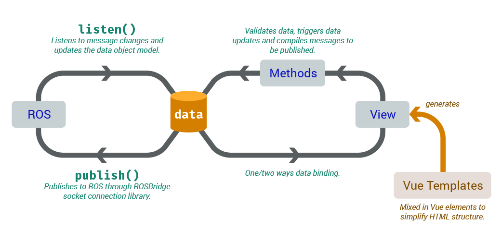

# RosDash

**Detailed documentation exists in `/docs/`**

## Author

Daniel Cheung

## Summary on GUI Architecture

The GUI should exist as a ROS node constructed by ROS Bridge. ROS Bridge, given its name, is exactly a bridge between the rest of ROS in C++, and the JavaScript environment, either in Node.js or simply a browser client. ROS Bridge connects to ROS by listening and pushing data using a port on a separate server than ROS master, and JavaScript connects to it via a web socket. 

## Introduction

This minimal library is built on top of RosBridge to provide a easier GUI development. This library depends on **Vue.js**. This library suggests a particular coding style using Vue.js, and the actual number of provided methods are not many.

RosDash provides an easier way to debug the JavaScript client of ROS. Because of some unknown design reasons, ROS does not return any error and ignores the JSON messages if they are not well structured and are published through RosBridge.

### Understanding Vue.js

Vue.js is a framework that manages a "virtual DOM". It performs way better than simply updating DOM with methods like jQuery, which changes the inner HTML of an element, forcing the browser to update the DOM in response. Vue.js, however, strongly binds values in the DOM to a JavaScript system. Updating texts in the DOM becomes much faster through Vue.js because it directly updates the DOM, unlike jQuery.

## Using RosDash



**RosDash recommends centralizing all data listened from ROS, and are saved to the same place.** 

1. Initializing all properties to be used to store data in a message under the Dashboard Vue.js instance.
   ```
   # Example message file
   # Gearshift.msg

   std_msgs/Bool reverse_mode
   std_Int8/Int8 speed_mode
   std_msgs/Int8 camera_profile_current
   ```
   Instantiate a Vue.js instance and declare initial values for fields in the message files. You may make up your own names for the properties, but the suggested way is to suffix the field name after the message type/purpose.
   ```javascript
   let Dashboard = new Vue({
       el: "#dashboard-root", //root of the Vue.js element
       data: {
           data: { //Collection of all data from ROS
               //Give default values to all properties you intend to use
               gearshift_reverse_mode: false,
               gearshift_speed_mode: 0,
               gearshift_camera_profile_current: 0
           }
       }
   });
   ```

2. Bind values to DOM by creating templates under the root specified when creating the Vue.js instance. In this case, it's `#dashboard-root`.

   ##### HTML source

   ```html
   <main id="dashboard-root">
       <!--A really basic Vue.js template string.-->
       <span>Reverse Mode: {{data.gearshift_reverse_mode}}</span>
   </main>
   ```
   The above template is converted to a proper DOM element when the Vue.js element is properly initiated, with the handlebars(`{{...}}`) be made into a one way binding text that updates when `Dashboard.data.gearshift_reverse_mode` is properly updated by properly assigning values. *(Vue.js uses **getters** and **setters** to dynamically bind DOM values when the JavaScript properties are changed. Changing stored data without accessing getters and setters would not inform Vue.js to update dependencies. You may read more about getters and setters on [MDN](https://developer.mozilla.org/en-US/docs/Web/JavaScript/Reference/Functions/set).)*

   ##### Rendered DOM

   ```HTML
   <!--DOM when Dashboard is just initiated.-->
   <main id="dashboard-root">
       <span>Reverse Mode: false</span>
   </main>
   ```

3. Listen to the ROS topic.

   ```javascript
   rosDash.listen(new ROSLIB.Topic({
       name: "teleop/gearshift",
       messageType: "beluga_msgs/Gearshift"
   }), function(messageData, dashboardData) {
       //Using the most basic method of assignment is the fastest.
       //ES6 destructuring assignment is getting faster and by the time I'm writing this, it is quite similar to the speed of this method.
       dashboardData.gearshift_reverse_mode = messageData.reverse_mode.data;
       dashboardData.gearshift_speed_mode = messageData.speed_mode.data;
       dashboardData.gearshift_camera_profile_current = messageData.camera_profile_current.data;
   });
   ```

   The `rosDash.listen()` function accepts a `ROSLIB.Topic` instance and a callback function to assign values into the data object within the `Dashboard` Vue.js instance. In this way, information from ROS may be displayed swiftly by Vue.js using data binding.

4. Publish messages to ROS topic.

   ```html
   <main id="dashboard-root">
       <span>Reverse Mode: {{data.gearshift_reverse_mode}}</span>
       <button type="button" v-on:click="toggleReverseMode()">Toggle reverse mode</button>
   </main>
   ```

   ```javascript
   //Save topic to rosCon instance
   rosCon.confirmTopicExists(new ROSLIB.Topic({
       name: "gui/gearshift",
       messageType: "beluga_msgs/Gearshift"
   }));

   let Dashboard = new Vue({
       el: "#dashboard-root", //root of the Vue.js element
       data: {
           data: { //Initialization of collection of all data to be exchanged with ROS
               //...
           }
       },
       methods: {
           toggleReverseMode: function() {
               let new_reverse_mode = !this.data.gearshift_reverse_mode; //this in a Vue.js method refers to the Vue.js instance itself, i.e. Dashboard here.
               rosCon.publish("gui/gearshift", {
                   reverse_mode: {data: this.data.gearshift_reverse_mode = new_reverse_mode},
                   speed_mode: {data: this.data.gearshift_speed_mode},
                   camera_profile_current: {data: this.data.camera_profile_current}
               });
           }
       }
   });
   ```

With the above steps, the whole listening and publishing cycle is complete, although there are other methods in the library to explore and use.

## Preset Vue.js Components

### Understanding Vue.js Components

Vue.js allows users to define HTML template components in JavaScript so that they can type custom HTML tags within the Vue.js root node before initializing the Vue.js instance, and the template will take over and generate the correct DOM according to the set template. To illustrate this, here is an example:

##### JavaScript (before Vue.js instance initialization)

```javascript
Vue.component('custom-tag-name', {
    template:
`<div class="some-class">
	<h1>{{myprop}}</h1>
	<slot></slot>
</div>`,
    /*
    The <slot> tag will transform into whatever content you put within your custom tag.
    Otherwise, {{}} templates will render out computed values, data, props, etc.
    */
  
    //Some possible properties of this components
  
    /*
    Beware that props are read-only when the components are initialized.
    If you want the rendered value to change, assign the value of the prop to a data when "mounted".
    */
    props: {
        "myprop": String
    },
    data: function() {
        return {}
    },
    methods: {},
    computed: {},
    mounted: function() {},
    //...
});
```

##### HTML source

```html
<div id="dashboard-root">
    <custom-tag-name myprop="some heading">
        <code>Hello World!</code>
    </custom-tag-name>
</div>
```

##### Rendered DOM

```html
<div id="dashboard-root">
    <div class="some-class">
        <h1>some heading</h1>
        <code>Hello World!</code>
    </div>
</div>
```

### RosDash Preset Components

#### Circular Indicator

The circular indicator is a ring indicator consisting of an outer thin ring and an inner thick ring, percentage text and a short descriptive title, with also an optional degree setting to indicate direction. The rings can indicate positive and negative numerical values.

The circular indicator was created to indicate motor direction and values, so it is most fitted at least to display motor information.

##### Attributes

-   `model: Object` - The data model of the view component. *(Read on MVC data structure)*

    ```javascript
    let model = {
        /**Inner ring value*/
        inner: Number,
      
        /**Outer ring value*/
        outer: Number,
      
        /**Total value. Acts as denominator of inner and outer value, to calculate percentage*/
        total: Number,
      
        /**Degree the arrow points to when inner value is positive. Flips direction when inner value is negative. Will not show arrow if inner value is 0 or degree is not a number*/
        degree: Number || undefined
    }
    ```

##### Content

Content of this element will become the descriptive title of the indicator.

##### Usages

```html
<circular-indicator :model="c1">Left Motor</circular-indicator>
```

**Notes**: `c1` is the model that already exists in the data of the Vue.js instance. `:model=""` is short-hand for `v-bind:model=""` which double binds the data object to the element's attribute.

#### State Indicator

The state indicator indicates states using color, icon and text. The indicator's icon can be icons from icon fonts such as Font Awesome.

##### Attributes

-   `model: Object` - The data model of the view component.

    ```javascript
    let model = {
        //current state by state id
        current: Number || String,
        states: {
            state_id_custom_name_1: {
                /**state description*/
                text: String,
                /**Font Awesome fa-xxx classes*/
                icon: String,
                /**Whether the icon lights up or not*/
                rating: "on" || "off"
            },
           state_id_custom_name_2: {/*...*/},
           //...
        }
    }
    ```

##### Content

*Content is not used for this element.*

##### Usages

```html
<state-indicator :model="s1"></state-indicator>
```

**Notes**: `s1` is the model that already exists in the data of the Vue.js instance.